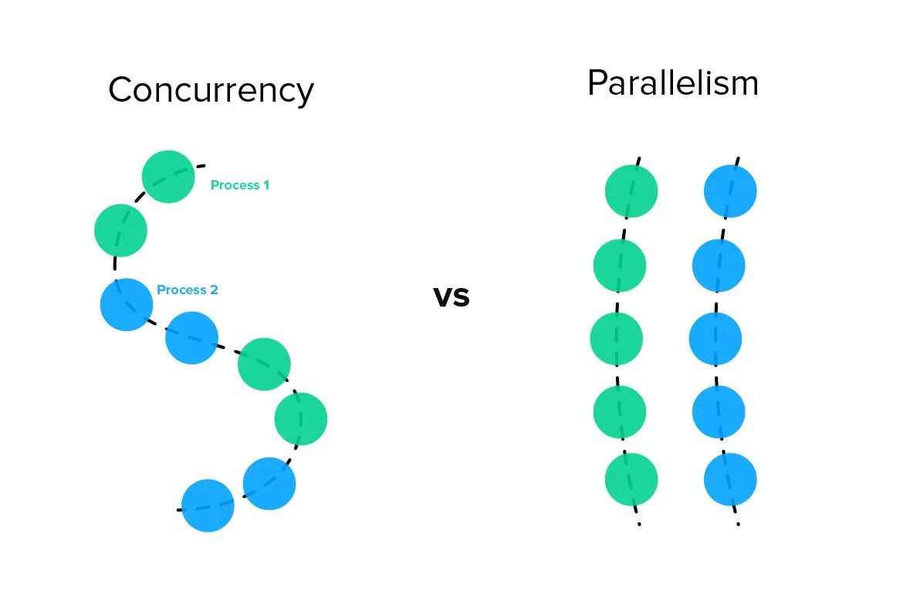

# Concurrency

# Before

## Process
> 프로그램이 CPU로 부터 자원(메모리)를 받아 실행되고 있는 상태.
- 작업의 단위
- 각 프로세스 마다 메모리 영역은 접근이 불가능하다.
- Stack(지역 함수, 지역 변수), Queue, Text(코드), Data(전역 변수) 이렇게 4개의 영역이 있다.

## MultiProcess, Context Switching
- 하나의 프로그램을 실행하면 여러개의 프로세스가 실행된다.
- CPU안에서는 한 번에 하나의 작업(프로세스)만 실행 가능하다. 
- 따라서 기존에 수행중인 프로세스를 멈추고 다른 프로세스를 실행할 때, Context Switching이 발생한다.
- 이로인해 오버헤드가 발생할 수 있다. (문제 상황)

## MultiThread
- Process 내에 여러 Thread
- 공유하는 자원이 있기 때문에 MultiThread가 Context Switching이 빠르다.

# Introduction

## Thread
> 프로세스 내에서 실제로 작업을 수행하는 주체.
- 작업 흐름의 단위
- Stack 영역을 할당 받고, 나머지는 공유한다.
- Swift에서는 Thread를 자동으로 관리하기 때문에, **프로그래머는 단순히 비동기 작업 (async/await)을 정의, 실행 순서 지정만 하면 된다.**
- 프로그래머는 메인쓰레드에 몰린 작업들을 대기행렬 Queue에 넣어주면 OS에서 알아서 처리해준다. (프로그래머는 Thread를 관리하지 않아도 된다.)

**Thread Pool**
> Thread를 생성하고 재사용하는 효율적인 시스템
- Swift에서 GCD(Grand Central Dispatch)를 통해 Thread Pool을 관리한다.

## Concurrency vs Parallelism

**Concurrency Programming**
- 여러 작업이 빠르게 번갈아 실행되는 것. (Context Switching)
- Single-Core

**Parallelism Programming**
- 여러 작업이 서로 다른 CPU 코어에서 동시에 실행되는 것
- Multi-Core



## Synchronous vs Asynchronous

**Synchronous**
- 작업을 순차적으로 실행된다. (직렬) 이전 작업이 완료될 때까지 다음 작업을 기다린다. 코드의 실행 흐름이 예측 가능하고 단순하다.

**Asynchronous**
- 작업들이 서로 독립적으로 실행된다. (병렬), 동시에 여러 작업을 처리할 수 있다. 한 작업이 완료되기를 기다리는 동안 다른 작업을 수행할 수 있어 효율적이다.

- Q. 그럼 Single-Core 환경에서 Asynchronous하게 실행할 수 있는가?
- A. Context Switching을 통해 여러 쓰레드를 번갈아 가며 실행하여 마치 여러 작업들이 동시에 실행되는 것처럼 구현할 수 있다.

- async/await: 비동기 함수를 정의하고 호출하는 Swift의 기본 키워드
- Task: 동시성 작업의 기본 단위로, 실행, 우선순위 및 관리를 담당하는 객체
- Actor: 데이터 경쟁을 방지하고 상태를 안전하게 관리하는 참조 타입

#  Asynchronous Function

## Defining and Calling Asynchronous Function

- *async* : 비동기 함수임을 알려주는 키워드
    - 함수 시그니처에서 () 다음 -> 전에 쓰면 된다. *throw*가 있으면 앞에 붙여주면 된다.
    
- *await* : 비동기 함수를 실행하려 할 때 앞에 쓴다.
    - try 뒤 함수 이름 앞에 쓴다.

```swift
func fetchUserData() async throws -> User {
    try await Task.sleep(nanoseconds: 1_000_000_000) // 1초 대기
    return User(id: 1, name: "John")
}
```

- *for-await-in loop* : 를 이용하여 for문 안에서 이미지를 비동기적으로 불러올 수 있다.
- Sequence Protocol을 채택하여 for-in loop안에서 반복할 수 있게 했던것 처럼 AsyncSequence Protocol을 채택하면 된다.

```swift
import Foundation

let handle = FileHandle.standardInput
for try await line in handle.bytes.lines {
    print(line)
}
```

## Calling Asynchronous Function in Parallel

- *async let* : 비동기 작업을 병렬적으로 처리할 수 있게 해준다.

```swift
let firstPhoto = await loadPhoto(index: 1) // 이 코드가 끝나야지만 아래 코드가 실행된다.
let secondPhoto = await loadPhoto(index: 2)
let thirdPhoto = await loadPhoto(index: 3)
let photos = [firstPhoto, secondPhoto, thirdPhoto]
```

```swift
async let firstImage = loadImage(index: 1)
async let secondImage = loadImage(index: 2)
async let thirdImage = loadImage(index: 3)
let images = await [firstImage, secondImage, thirdImage]
```
- 사진을 불러오는 위 코드는 모두 병렬적으로 실행된다.

# Task & Task Groups

## Task
> A task is a unit of work that can be run asynchronously as part of your program.

프로그램에서 비동기적으로 실행되는 작업 단위. 여러가지 Task를 만들게 되면, Swift에서는 동시에 Task를 돌리게 된다.

## Task Groups

Task는 부모 Task가 있으며, 자식 Task를 가질 수 있다.


## Task Cancellation

```swift
await withTaskGroup(of: Data.self) { group in
    let photoNames = await listPhotos(inGallery: "Summer Vacation")
    for name in photoNames {
        group.addTask {
            return await downloadPhoto(named: name)
        }
    }

    for await photo in group {
        show(photo)
    }
}
```

- group.addTask : 새로운 Task를 Task Group에 추가한다.
- for await photo in group : Task가 먼저 종료되는 순서로 show(photo) 가 실행된다.

```swift
let photos = await withTaskGroup(of: Data.self) { group in
    let photoNames = await listPhotos(inGallery: "Summer Vacation")
    for name in photoNames {
        group.addTask {
            return await downloadPhoto(named: name)
        }
    }

    var results: [Data] = []
    for await photo in group {
        results.append(photo)
    }

    return results
}
```
- 사진이 개별 Task가 종료되는 대로 show(photo)가 호출 되었던 코드와 달리 모든 사진이 다운되면 [Data]를 반환하고 종료된다.

## Task Cancellation
- 각 Task는 취소가 적절한 때에 이루어졌는지 판단하고, 취소에 적절하게 대응한다.
- Cancellation의 의미는 주로 다음과 같다.
    - Throw CancellationError
    - Returning nil or empty collection
    - Returning the partially completed work

## How to Cancel

1. Task.checkCancellation() -> Bool 호출

2. Task.isCancelled: Bool 읽기

```swift
if Task.checkCancellation() {
    // Cancelled
} 

guard Task.isCancelled else {return nil}
```

# Structured Concurrency & Unstructured Concurrency

## Structured Concurrency
- Task는 모두 부모가 있고, 자식을 가질 수 있다. 이런 접근을 Structured Concurrency 라고 한다.

### 장점
1. 부모 Task에서 자식 Task가 끝나는 것을 놓치는 것을 방지할 수 있다.
2. 자식 Task에 더 우선시 되는 Task를 추가하면 부모 Task는 자동적으로 더 높은 우선순위를 갖는다.
3. 부모 Task가 취소(canceled)되면 자식 Task도 자동으로 취소된다.
4. 부모 Task-local의 값이 효율적으로 자식 Task에 전파된다.

## Unstructured Concurrency

- Task에 부모가 없다.
- Task.init()으로 직접 생성한다.
- 직접 detached()를 호출하여 작업 종료를 알려야 한다.

# Actor 
> 상태를 격리하여 데이터 경쟁(data race)을 방지하고, 동시 접근으로 인한 예기치 않은 동작을 방지한다.

## Actor의 특징
- 참조 타입
- 단일 접근 보장
- 비동기적 상태 접근
    - Actor의 속성이나 메서드에 접근할 때는 await 키워드를 사용하여 비동기적으로 접근한다.

```swift
actor Counter {
    var value = 0
    
    func increment() {
        value += 1
    }
    
    func getValue() -> Int {
        return value
    }
}
```
```swift
let counter = Counter()

Task {
    await counter.increment()
    let currentValue = await counter.getValue()
    print("Current value: \(currentValue)") // "Current value: 1"
}
```
메서드는 await를 통해 비동기적으로 실행한다.

### Actor vs Class
- 공통점 : 

    1. 참조 타입
    2. 메서드와 속성을 가질 수 있다.

- 차이점 : 

    1. Actor는 동시성 제어를 통해 데이터 경쟁 문제를 예방할 수 있다.
    여러 스레드에 접근하더라도, 한 번에 하나의 스레드만 Actor의 상태에 접근할 수 있도록 보장한다.


참고 블로그 <br>
<a href="https://seokyoungg.tistory.com/m/25">seok-young
님의 [iOS] 동시성 프로그래밍(1)</a>