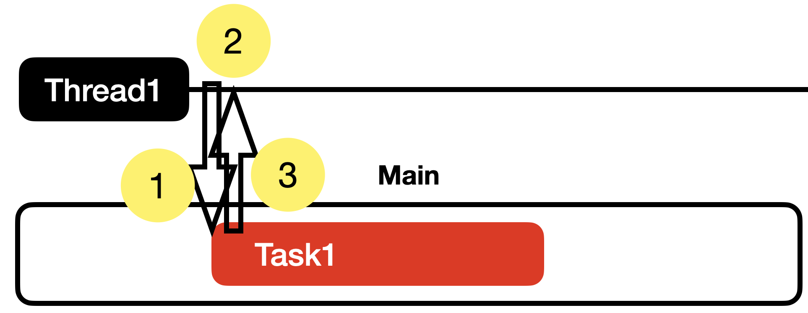

# 머릿말
동시, 순서, 동기, 비동기, DispatchQeueu, GCD, QoS 등에 간단하게 하도 알고 계시면 이 글을 읽으시는걸 추천드려요. 하지만, 잘 모르시면 을 미리 읽고 오시는 것을 추천합니다.

# DispatchQueue

Dispatch Queue를 단어 그대로 해석한다면 **'전송(하는) 큐'**는 의미입니다. 즉, 작업을 어떤 큐에 전송하라는 뜻이죠. 자주 사용하는 코드로 예시를 볼까요?

```swift
DispatchQueue.main().async {
	// 작업
}
```

- `main()` 은 큐의 종류 중 하나입니다. 메인 큐라고 부르죠
- `async` 는 비동기적으로 보내라는 의미입니다. 즉, 종료를 기다리지 말고 다음 작업을 하라는 이미입니다.

이 코드는 **'작업을 비동기 적으로 메인에 전송하는 큐'**는 의미가 되겠네요.

`DispatchQueue.main().async{}` 라는 코드는 DispatchQueue를 구체화해서 정확히 어떤 큐에 작업을 보내고 작업 종료의 대기 여부를 결정합니다.

이제 DispatchQueue를 사용하는 방법을 알게 되신겁니다.

앞으로 큐의 종류, 큐의 서비스 품질, (동기, 비동기)를 알아보며 각자 어떤 역할을 하는지 알아보겠습니다.

# DispatchQueue의 종류

## 메인 큐 (Main Queue)

- 공식문서
> The dispatch queue associated with the main thread of the current process.

현재 프로세스에서 메인 큐는 메인 쓰레드(1번 쓰레드)로 보내는 전송 큐입니다.

### 메인 쓰레드 (Main Thread)
그럼 메인 쓰레드란? iOS, MacOS 등에서 사용자와의 상호작용 혹은 UI를 그리는 작업을 합니다. 만약 조금이라도 딜레이가 보인다면 사용자는 앱이 고장났다고 생각할 수 있기 때문에 반드시 필요하지 않는다면 대부분 다른 쓰레드에서 작업을 실행시키는게 좋습니다.

익숙한 코드를 보며 어떤 의미였는지 천천히 살펴보겠습니다.

```swift
DispatchQueue.main.async {
	// Task1
}
// Task2
```


1. 메인 큐에 비동기적으로 작업 Task1을 전송한다.
2. 메인 쓰레드는 Task1의 종료를 기다리지 않고 다음 작업(Task2)를 수행한다.
3. 메인 큐는 적재된 작업을 메인 쓰레드에 전송한다.
4. Task1의 코드가 실행된다.

코드로 실행하게 된다면 아래와 같을 것입니다.

```swift
import Foundation
print("Task0")
DispatchQueue.main.async {
    sleep(1) // 지연을 표현하기 위한 코드
    print("Task1")
    exit(0) // 프로그램 종료
}
print("Task2")
RunLoop.main.run() // 프로그램 종료 방지
```

```
Task0
Task2
Task1
```

잠깐, 우리가 짜는 코드는 대부분 순서대로 메인 쓰레드에서 돌아가는데 왜 굳이 또 메인으로 보내야 하는 걸까요? 만약 사실상 우리가 짜는 코드는 `main.sync(){}` 아닌가? 라고 생각하실 수 있습니다. 

## 왜 굳이 메인으로 보내는가?

```DispatchQueue.main.async``` 코드를 쓰는 상황을 다시 한 번 생각해 볼까요? 주로 네트워크 컴플리션 핸들러와 같은 비동기 작업이 끝난 결과를 UI에 반영하는 코드를 넣었을 겁니다. 이 코드는 비동기 작업이 완료 되고 이 결과를 UI에 반영하기 위한 것처럼 반드시 메인 쓰레드에서 작동해야 하는 작업을 의미합니다.

그럼 위 사진은? 저 코드가 메인에서 실행 되었기 때문에 저렇게 그렸을 뿐, 실제 여러분이 사용하셨던 코드는 아래 사진과 같았을 겁니다.


1. 네트워크 작업 종료이후 `DispatchQueue.main.async{}` 실행
2. 비동기 메인 큐로 보냄
3. 메인 큐는 메인 쓰레드에 작업을 보냄
4. 메인 쓰레드에서 Task1 실행

## main.sync는 데드락을 발생시킨다!

공식문서를 보겠습니다.
> Attempting to synchronously execute a work item on the main queue results in deadlock.

만약, 동기적으로 메인 큐에 작업을 실행하게 된다면 데드락이 발생한다고 경고하고 있습니다.


```swift
DispatchQueue.main.sync {
    // 작업
}
```


1. Task1을

main 쓰레드가 어떤 작업이 끝나기를 기다리는 것은 매우 위험합니다. 다른 중요한 작업들이 많기 때문이죠.

메인 큐는 UI를 그리는 작업을 하기 때문에 다른 작업이 지연되는 것을 지양합니다. UI 작업이 느려지면 사용자는 앱이 고장난것으로 간주할 수 있기 때문이죠, 그래서 작업이 오래 걸리는 경우 비동기 작업으로 빼는 것입니다.

## 글로벌 큐 (Global Queue)

공식문서
> Returns the global system queue with the specified quality-of-service class.

```swift
class func global(qos: DispatchQoS.QoSClass = .default) -> DispatchQueue
```

qos가 정해진 전송 큐를 반환하는 타입 메서드입니다.

또한, 글로벌 큐는 동시 큐입니다. 이 설정은 바꿀 수 없습니다.

왜일까요? 제 개인적인 생각으로 글로벌 큐는 QoS가 중요한 전송 큐입니다. 만약, 글로벌 큐가 순서큐라면 어떻게 될까요? QoS를 설정하는 것이 의미가 없어지겠죠.

## 프라이빗 큐 (Private Queue)

공식문서
> Creates a new dispatch queue to which you can submit blocks.

`let queue = DispatchQueue(label: "com.example.concurrentQueue")`

사용자가 원하는 전송 큐를 만들 수 있다.

```swift
init(
    label: String,
    qos: DispatchQoS = .unspecified,
    attributes: DispatchQueue.Attributes = [],
    autoreleaseFrequency: DispatchQueue.AutoreleaseFrequency = .inherit,
    target: DispatchQueue? = nil
)
```

qos : .unspecified (기본)
attributes : [] (기본, serial 큐를 의미합니다.) / 동시 큐를 원한다면 .concurrent로 설정하면 됩니다.

## 정리

```swift
DispatchQueue.{큐 종류 (main, global, private)}(qos: QoS).{async/sync} {
	// 작업
}
```

아래 테이블은 Queue의 종류별로 고정된 값을 정리했습니다.
|Queue 종류	| 특징 |	QoS 제약 |	큐 유형 제약 |
| --       | --- | --- | --- |
|main       |UI 스레드 전용  | .userInteractive 고정| 	Serial(순서) 고정 |
|global     |시스템 글로벌 큐 |	모든 QoS 사용 가능 |	Concurrent(동시) 고정 |
|private    |커스텀 큐      | 모든 QoS 사용 가능 |	Serial/Concurrent 모두 가능 |

참고 자료

앨런 iOS Concurrency(동시성)

https://www.inflearn.com/course/ios-concurrency-gcd-operation/dashboard

애플 공식문서