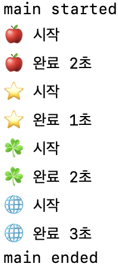
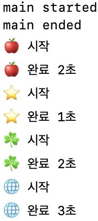
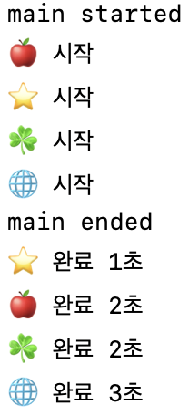

# 코드로 이해하기

```swift
let times: [UInt32] = [2, 1, 2, 3]

func task1() {
    print("🍎 시작")
    sleep(times[0])
    print("🍎 완료 \(times[0])초")
}

func task2() {
    print("⭐️ 시작")
    sleep(times[1])
    print("⭐️ 완료 \(times[1])초")
}

func task3() {
    print("☘️ 시작")
    sleep(times[2])
    print("☘️ 완료 \(times[2])초")
}

func task4() {
    print("🌐 시작")
    sleep(times[3])
    print("🌐 완료 \(times[3])초")
}

print("main started")
// 큐 전송 코드
print("main ended")
```

- taskN() : 일정 시간동안 작업을 중단하고 이후에 작업을 이어나갑니다.

# 메인 큐 (Main Queue)
- main()은 기본적으로 순서 큐이다. 또한 sync 메서드는 사용할 수 없으므로 async만 사용할 수 있다.

`main().sync {}` 실행하면 데드락이 발생한다.


1. 메인 쓰레드에서 메인 큐로 동기적으로 작업을 본낸다.
2. 메인 쓰레드는 작업의 종료를 기다린다.
3. 메인 큐는 메인 쓰레드에 작업을 보낸다. **하지만 메인 쓰레드는 작업의 종료를 기다리는 중이므로 작업을 받을 수 없는 상황**

```swift
task1()
task2()
task3()
task4()
```



- 작업의 순서를 보장한다. 메인 큐는 순서큐이기 때문
- 작업의 완료를 기다린다. task 함수의 작업 완료를 기다린다.

```swift
DispatchQueue.main.async{ task1() }
DispatchQueue.main.async{ task2() }
DispatchQueue.main.async{ task3() }
DispatchQueue.main.async{ task4() }
```



- 작업의 순서는 보장한다.
- 작업의 완료를 기다리지 않는다. task 함수를 큐에 보내고 다음 작업을 계속 이어나갔습니다. 그래서, 함수가 왼료되기 전에 메인 쓰레드는 종료된 것입니다.

# 글로벌 큐 (Global Queue)

- 글로벌 큐는 동시 큐가 고정이고 바꿀 수 없다. 따라서 작업의 순서를 보장하지 않는다.

- 동기적으로 작업을 보내면

```swift
DispatchQueue.global().sync { task1() }
DispatchQueue.global().sync { task2() }
DispatchQueue.global().sync { task3() }
DispatchQueue.global().sync { task4() }

- 작업의 순서를 보장한다? Global Queue에 작업을 보내면 메인 쓰레드에서 작업이 끝나기를 기다리고 다음 작업을  Queue에 보내죠. 따라서 순서를 보장하는 것처럼 보일 뿐입니다.
- 작업의 완료를 기다린다. 
```


- 비동기적으로 작업을 보내면
```swift
DispatchQueue.global().async { task1() }
DispatchQueue.global().async { task2() }
DispatchQueue.global().async { task3() }
DispatchQueue.global().async { task4() }
```



# 프라이빗(커스텀) 큐 (Private Queue)

- 프라이빗 큐는 기본값으로 순서 큐이다. 커스텀 큐 답게 QoS를 모두 바꿀 수 있고, (순서, 동시) 또한 바꿀 수 있습니다.

```swift
let queue = DispatchQueue(label: "com.example.concurrentQueue")
queue.sync { task1() }
queue.sync { task2() }
queue.sync { task3() }
queue.sync { task4() }
```


- 작업의 순서를 보장한다.
- 작업의 완료를 기다린다.

```swift
let queue = DispatchQueue(label: "com.example.concurrentQueue")
queue.async { task1() }
queue.async { task2() }
queue.async { task3() }
queue.async { task4() }
```


위의 글로벌 큐와 똑같이 실행됩니다.