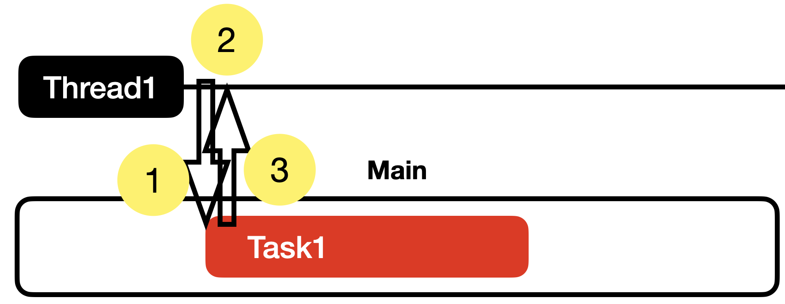

# 코드로 DispatchQueue 이해하기

# 메인 큐 (Main Queue)
- main()은 기본적으로 메인 쓰레드로만 보내는 순서 큐입니다. 또한, sync 메서드는 금기입니다. 데드락이 발생하기 때문인데요. 제가 생각하는 데드락이 발생하는 과정을 알아보겠습니다.

1. 메인 쓰레드에서 메인 큐로 동기적으로 작업을 보낸다.
2. 메인 쓰레드는 작업의 종료를 기다린다.
3. 메인 큐는 메인 쓰레드에 작업을 보낸다. **하지만 메인 쓰레드는 작업의 종료를 기다리는 중이므로 작업을 받을 수 없는 상황**

- 작업의 순서를 보장한다. 메인 큐는 순서큐이기 때문
- 작업의 완료를 기다린다. task 함수의 작업 완료를 기다린다.

# 글로벌 큐 (Global Queue)

- 글로벌 큐는 동시 큐가 고정이고 바꿀 수 없다. 따라서 작업의 순서를 보장하지 않는다.

- 동기적으로 작업을 보내면

- 작업의 순서를 보장한다? Global Queue에 작업을 보내면 메인 쓰레드에서 작업이 끝나기를 기다리고 다음 작업을  Queue에 보내죠. 따라서 순서를 보장하는 것처럼 보일 뿐입니다.
- 작업의 완료를 기다린다. 

# 프라이빗(커스텀) 큐 (Private Queue)

- 프라이빗 큐는 기본값으로 순서 큐이다. 커스텀 큐 답게 QoS를 모두 바꿀 수 있고, (순서, 동시) 또한 바꿀 수 있습니다.

- 작업의 순서를 보장한다.
- 작업의 완료를 기다린다.

위의 글로벌 큐와 똑같이 실행됩니다.