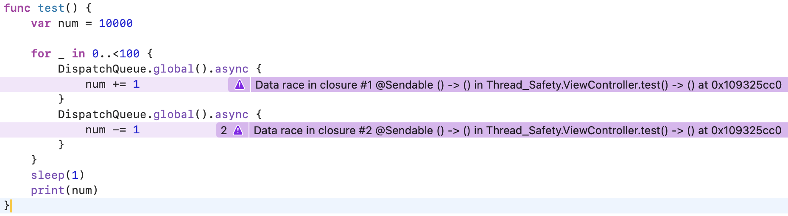

# Overview

동시성 코드를 실행하다 보면 여러가지 문제가 발생할 수 있습니다. 동시적으로 같은 메모리 주소에 접근하거나, 서로가 자원을 점유한 채 서로의 자원을 기다리는 상황이 생길 수 있습니다. 이러한 문제를 안전하게 처리할 수 있는 상태를 `Thread Safety(쓰레드 안정성)` 라고 합니다.

Swift 5.5에서 등장한 Swift Concurrency는 이러한 문제를 예방하고자 여러 프로토콜과 타입을 제공합니다. 덕분에 많은 동시성 문제를 컴파일 단계에서 미리 잡아 낼 수 있게 되었고 런타임 에러 발생 가능성을 줄일 수 있게 되었습니다. 오늘은 Swift Concurrency 자체를 다루지 않고, 추후 별도의 포스트에서 다뤄보겠습니다.

# 동시성 관련 문제

우선, 동시성 관련해서 어떤 문제들이 발생할 수 있는지 알아보겠습니다.

## 경쟁 상황 (Race Condition)

- 2개이상의 쓰레드에서 공유된 데이터에 접근 동시적으로 접근하는 경우 발생할 수 있는 문제입니다. 동시에 읽기를 진행한다면 문제는 안되겠죠. 하지만, 동시에 쓰기 작업을 실행한다면 이는 순서를 반드시 잘 정해줄 필요가 있습니다.

## 교착 상태 (DeadLock)

시스템 자원에 대한 요구가 엉킨 상태를 데드락이라고 합니다.

예를 들면, 프로세스 A와 B 각각 자원 X, Y를 점유하고 있습니다. A는 자원 Y가 해제되기를 기다리는 중이며, B는 자원 X가 해제 되기를 기다리는 중입니다. 그렇게 되면 무한 대기에 빠지게 됩니다.

## 우선 순위 역전 (Priority Inversion)

낮은 우선 순위의 작업이 자원을 배타적으로 사용하고 있을 때, 작업의 우선순위가 바뀌는 경우

이는, GCD가 낮은 우선순위의 작업의 우선순위를 (임시로) 높여서 빨리 동작시킬 수 있습니다. 

# Thread Safety

앨런님 강의에서 Thread Safety 정의는 이렇습니다.

**“데이터(객체나 변수 등)에 여러 쓰레드를 사용하여 접근하여도, 한번에 한개의 쓰레드만 접근가능하도록 처리하여 경쟁상황의 문제없이 사용”**

그렇다면 Thread Safety를 고려해야하는 상황은 어떤 상황일까요? 메인 쓰레드 이외의 다른 큐에서 메모리 주소에 접근할 수 있는 경우입니다. 메인 쓰레드에서만 동작한다면, 굳이 생각할 필요는 없을겁니다.

어떤 방법으로 Thread Safe Code 를 작성할 수 있을지 알아보겠습니다.

# 시리얼 큐와 sync

비동기적인 작업에서 어떤 자원에 접근할 때, 동일한 시리얼 큐와 sync를 통해 순서를 강제적으로 지정한다면 경쟁 상황을 피할 수 있습니다.

### 문제 예시 코드
```swift
var num = 10000
for _ in 0..<100 {
    DispatchQueue.global().async {
        num += 1
    }
    DispatchQueue.global().async {
        num -= 1
    }
}

sleep(1)
print(num)
```

10번 실행하면 1 번은 10000이 아닌 다른 수가 출력되기도 합니다. 즉, 경쟁 상황이 발생하여 값이 덮어씌워진 것입니다.



위 코드를 함수화 하고 Simulator에서 실행한 결과입니다. TSan(Thread Sanitizer)을 이용해서 확인해본 결과 Data race가 발생한다고 경고하고 있습니다.

### 예시 코드

```swift
class SafeCounter {
    private var value: Int = 10000
    private let queue = DispatchQueue(label: "safe.counter.queue")

    func increment() {
        queue.sync {
            self.value += 1
        }
    }

    func decrement() {
        queue.sync {
            self.value -= 1
        }
    }

    func getValue() -> Int {
        queue.sync {
            return self.value
        }
    }
}
```

위 코드는 value에 읽기/쓰기 작업을 하는 경우 시리얼 큐와 sync를 이용해서 데이터 경쟁을 방지하는 코드입니다. 같은 조건에서 실행하게 되어도 Data race가 발생하지 않습니다.


