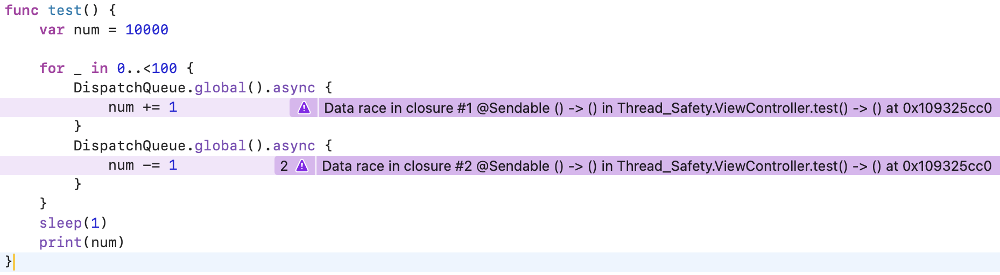

# 시리얼 큐와 sync

비동기적인 작업에서 어떤 자원에 접근할 때, 동일한 시리얼 큐와 sync를 통해 순서를 강제적으로 지정한다면 Data race와 Race condition을 피할 수 있습니다.

### 문제 예시 코드
```swift
var num = 10000
for _ in 0..<100 {
    DispatchQueue.global().async {
        num += 1
    }
    DispatchQueue.global().async {
        num -= 1
    }
}

sleep(1)
print(num)
```

10번 실행하면 2번은 10000이 아닌 다른 수가 출력되기도 합니다. 즉, 경쟁 상황이 발생하여 값이 덮어씌워진 것입니다. TSan으로 확인해본다면 Data race가 발생하는 지점을 알려주기도 합니다.



위 코드를 함수화 하고 Simulator에서 실행한 결과입니다. TSan(Thread Sanitizer)을 이용해서 확인해본 결과 Data race가 발생한다고 경고하고 있습니다.

### 예시 코드

```swift
class SafeCounter {
    private var value: Int = 10000
    private let queue = DispatchQueue(label: "safe.counter.queue")

    func increment() {
        queue.sync {
            self.value += 1
        }
    }

    func decrement() {
        queue.sync {
            self.value -= 1
        }
    }

    func getValue() -> Int {
        queue.sync {
            return self.value
        }
    }
}
```

위 코드는 value에 읽기/쓰기 작업을 하는 경우 시리얼 큐와 sync를 이용해서 Data race을 방지하는 코드입니다. 같은 조건에서 실행하게 되어도 Data race가 발생하지 않습니다.

[프로젝트 코드: 시뮬레이터 환경에서 실행 후, TSan으로 확인해보세요](https://github.com/Rudy-009/Swift/tree/main/DispatchQueue/6.%20sync%20(Thread%20Safety)/Thread-Safety)
