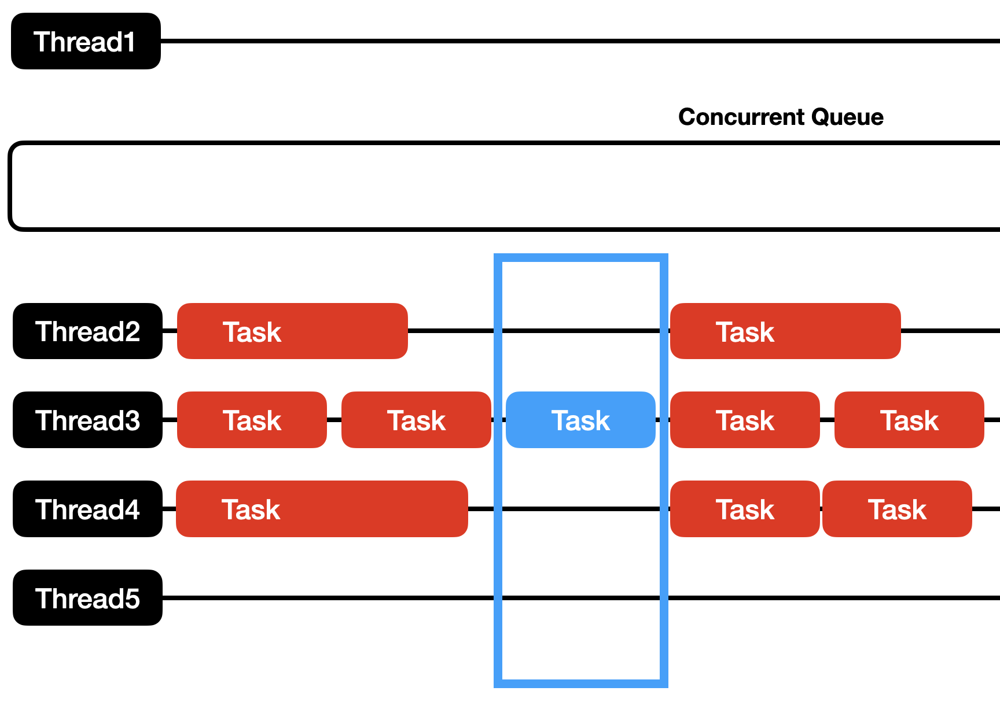

# Overview

이전 글에서 시리얼큐와 `sync`를 이용해 Thread Safety Code 를 작성하는 방법을 알아보았습니다. 이번에는 동시적 큐를 이용하며, Dispatch Barrier를 이용해  Thread Safety Code 작성 법을 알아보겠습니다.

# Dispatch Barrier

- Bsrrier 처리가 된 하나의 작업만 실행되며 다른 작업은 Barrier 처리가 된 작업이 종료되기를 기다립니다.



- Barrier 이전: Barrier 태스크(파란색)가 큐에 제출되면, 큐는 이미 실행 중인 모든 태스크(빨간색)들이 완료될 때까지 기다립니다.

- Barrier 실행: 모든 이전 태스크가 완료되면, Barrier 태스크는 큐의 모든 스레드에 대한 독점적인 접근을 얻어 단독으로 실행됩니다. 이 시간 동안 다른 태스크들은 실행되지 못하고 대기합니다.

- Barrier 이후: Barrier 태스크가 완료되면, 큐는 다시 정상적인 동시 실행 모드로 돌아가 Barrier 이후에 들어온 태스크들을 병렬로 처리합니다.

```swift
class BarrieredArray<T> {

    private var array = [T]()
    private let queue = DispatchQueue(
        label: "com.main.BarrieredArray",
        attributes: .concurrent
    )

    func append(_ element: T) {
        queue.async(flags: .barrier) {
            self.array.append(element)
        }
    }

    var elements: [T] {
        var result = [T]()
        queue.sync {
            result = self.array
        }
        return result
    }
}

let safeArray = BarrieredArray<Int>()

// 여러 스레드에서 동시에 쓰기 작업 실행
for i in 0..<100 {
    DispatchQueue.global().async {
        safeArray.append(i)
    }
    print(safeArray.elements)
}
print(safeArray.elements)

// 2초 후 최종 배열 확인
DispatchQueue.global().asyncAfter(deadline: .now() + 2) {
    print("Final Array Count: \(safeArray.elements.count)")
}

RunLoop.current.run(until: Date(timeIntervalSinceNow: 4))
```

- 쓰기 작업에서 `async(flags: .barrier)`를 통해 동시 큐에서 독점적으로 쓰레드를 사용합니다. 반면, 읽기 작업은 `sync`를 사용해 동기적으로 처리합니다. 이처럼 Dispatch Barrier를 사용하면 쓰기 작업 시에만 배타적으로 접근하고, 읽기 작업은 동시성을 허용함으로써 스레드 안전성과 성능을 모두 확보할 수 있습니다.