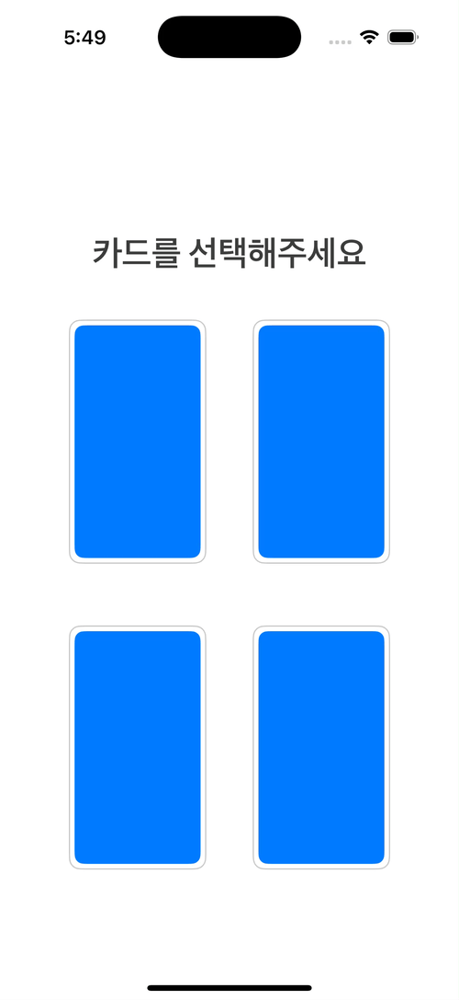

# Overview


# 콜백 지옥



위 애니메이션을 구현하는 과정에서 콜백 지옥을 경험했다. 당시에는 짧은 시간 내에 결과를 도출해야 했기에 되는대로 구현할 수 밖에 없었다. 추후, Swift Concurrency로 마이그레이션을 하여 코드 가독성을 증가시키고 싶었다.

```swift
UIView.animate(withDuration: 0.3) {
        // 선택되지 않은 카드들은 흐리게 처리
} completion: { _ in // dim 효과 완료 후 카드 확대 애니메이션
    UIView.animate(withDuration: 1.0, delay: 0, usingSpringWithDamping: 0.7, // 스프링 효과를 더 부드럽게
                    initialSpringVelocity: 0.3) { // 초기 속도를 낮춤
        // ...
    } completion: { _ in
        UIView.transition(with: sender, duration: 0.7, options: .transitionFlipFromRight, animations: nil) { _ in
            UIView.transition(with: sender, duration: 0.7, options: .transitionFlipFromRight, animations: nil) { _ in
                UIView.transition(with: sender, duration: 0.5, options: .transitionFlipFromRight, animations: nil) { _ in
                    // 훨씬 더 많음
                    // ...
                } // Third 0.5
            } // Second: 0.7
        } // First: 0.7
    }
}
```

# Swift Continuation
Apple에서 Swift Concurrency를 지원한다고 해서 모든 함수를 async/await가 호환되는 내부 함수를 만들어 줄 수는 없으며 시간이 많이 걸리는 작업이다. 따라서, `Continuation`를 이용하면 async/await를 지원하지 않는 비동기 함수를 async/await가 지원되는 다른 코드 안에서 실행시킬 수 있게 함수를 직접 만들 수 있다. 

## 새로운 함수로 만들기


## async가 가능한 동일한 시그니쳐 타입 함수 확장
